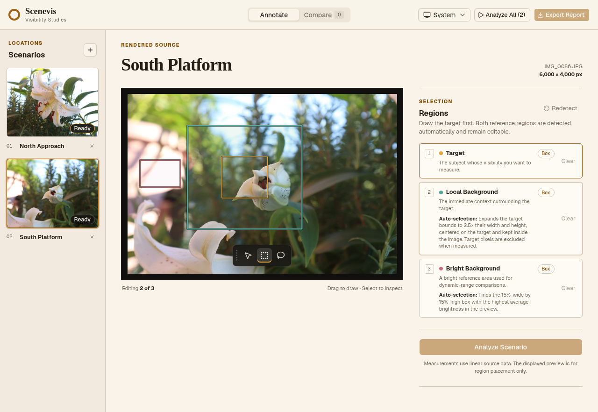
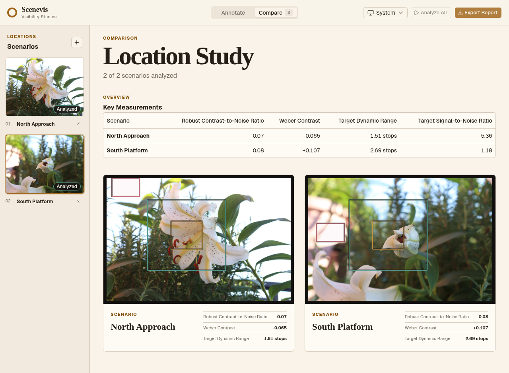

# Scenevis

[](https://gitlab.com/riccardofagiolo17/scenevis/-/pipelines)

> [!IMPORTANT]
> [GitLab](https://gitlab.com/riccardofagiolo17/scenevis) is the canonical home for Scenevis.
> The [GitHub repository](https://github.com/riccardostokker/scenevis) is a read-only mirror.
> Please open issues and merge requests on GitLab.

Scenevis measures how clearly a selected target separates from its photographic surroundings. It
combines an interactive React workspace with a typed Python analysis engine for RAW and raster
images, then turns several photographed locations into one comparable visibility study.

The workflow is visual: add images, mark each target, review the suggested reference regions, and
compare the resulting measurements. No YAML sidecars or project files are required.

## Interface



*Draw or refine each target and its reference regions directly over the source preview.*



*Compare the most important measurements across locations before opening the full report.*

> [!NOTE]
> Scenevis is an engineering comparison tool, not a calibrated lux meter. Measurements use
> normalized linear image data; exposure-adjusted previews are used only for region placement.

## What It Does

- Accepts multiple Canon CR2, DNG, JPEG, PNG, and TIFF images in one workspace.
- Keeps scenario names, regions, previews, and results in browser memory.
- Supports box and freehand lasso selection with editable SVG regions.
- Suggests local and bright reference regions as soon as the target is drawn.
- Calculates eight ordered target-visibility measurements from linear source data.
- Compares completed scenarios in aligned frames and a summary table.
- Exports a self-contained HTML report with compressed images, zones, warnings, and KPI notes.
- Supports light, dark, and system themes from desktop down to narrow screens.

## Quick Start

[Install mise](https://mise.jdx.dev/getting-started.html), then let the repository provision its
pinned Python, uv, Node.js, pnpm, prek, and git-cliff toolchain:

```sh
git clone git@gitlab.com:riccardofagiolo17/scenevis.git
cd scenevis
mise install
mise run sync
mise run dev
```

Open <http://127.0.0.1:5173> and follow the workspace from left to right:

1. Drop or choose one or more photographs.
2. Rename each scenario when the filename is not descriptive enough.
3. Select **Target**, then draw it with the floating **Box** or **Lasso** tool.
4. Review or refine the detected **Local Background** and **Bright Background**.
5. Analyze each scenario, or use **Analyze All** when every target is ready.
6. Open **Compare**, then export the finished location study as HTML.

## Automatic Regions

The target always comes from the user. The other two boxes are suggestions and remain fully
editable:

- **Local Background** expands the target bounds to 2.5 times their width and height, centers the
  box on the target, and keeps it inside the image. Target pixels are excluded when this region is
  measured.
- **Bright Background** scans the display preview for the 15%-wide by 15%-high box with the
  highest average brightness.

Select **Redetect** at any time to rebuild both suggestions from the current target.

## Measurements

Scenevis orders evidence by its usefulness when comparing target visibility:

| Measurement | What it shows |
| --- | --- |
| Robust Contrast-to-Noise Ratio | Target separation from its local background, including variation in both regions |
| Weber Contrast | Signed target brightness relative to the local background |
| Target Dynamic Range | Bright-background to target separation in photographic stops |
| Target Signal-to-Noise Ratio | Target signal relative to variation within the target region |
| Bright-Background Clipping | Share of reference pixels at or above 99% |
| Target Shadows Below 1% | Share of target pixels near the normalized linear shadow floor |
| Local-Background Dynamic Range | Bright-background to local-background separation in stops |
| Michelson Contrast | Symmetric supporting contrast between target and local background |

Validity warnings are shown separately from the measurements. There are deliberately no universal
pass/fail thresholds: acceptable visibility depends on the scene, display, task, and observer.

## Reports and Data Handling

The exported HTML report embeds a compressed display preview and validated zones for every
completed scenario. It also contains an aligned comparison table, ordered KPI values, their
plain-language descriptions, and measurement warnings. The artifact has no external assets or
executable scripts, so it can be opened and shared as a single file.

The browser keeps the original image, selections, preview, and result in memory for the current
session. The local backend uses bounded temporary files only while decoding a request. It does not
retain images, persist analysis state, or create region sidecars.

## Packaged Application

Build the frontend into the Python package and start the single-word CLI:

```sh
mise run build:dev
uv run --no-sync scenevis
```

`uv run --no-sync scenevis --no-browser` starts the packaged application without opening a browser.
The packaged service listens on `127.0.0.1:8765` by default.

## Architecture

The repository is divided by workflow ownership:

```text
scenevis/
├── app/                              React 19 and Vite 8 application
│   └── src/
│       ├── app/                      application composition
│       ├── components/ui/            shadcn UI primitives
│       ├── features/scene-analysis/ scenario editing, comparison, and reports
│       └── shared/api/               generated contract types and client
├── src/scenevis/
│   ├── scene/                        image loading and normalized regions
│   ├── analysis/                     statistics and visibility formulas
│   └── api/                          ephemeral FastAPI transport
├── tests/                            Python and full-camera integration tests
└── mise.toml                         unified developer command surface
```

FastAPI owns the OpenAPI contract. `openapi-typescript` derives the frontend schema from it, and
`mise run contract:check` prevents drift. The transport exposes two commands:

- `POST /api/previews` returns a compressed preview, image metadata, and a bright-background
  suggestion.
- `POST /api/analyses` accepts the image plus normalized in-memory regions and returns the
  measurements with the validated regions that produced them.

Both operations use a stable error envelope and reject unsupported, empty, or larger-than-100 MiB
uploads.

## Python API

The analysis engine can also be used without the browser:

```python
from pathlib import Path

from scenevis import Rectangle, Regions, analyze_scene

regions = Regions(
    target=Rectangle(x=0.40, y=0.35, width=0.12, height=0.18),
    local_background=Rectangle(x=0.30, y=0.25, width=0.32, height=0.38),
    bright_background=Rectangle(x=0.72, y=0.08, width=0.18, height=0.20),
)
result = analyze_scene(image_path=Path("scene.CR2"), regions=regions)

print(result.metrics.cnr_robust)
print(result.metrics.dr_target_median_stops)
```

The primary formulas are:

```text
DR_target = log2(bright_median / target_median)
Weber = (target_median - local_median) / local_median
Michelson = (target_median - local_median) / (target_median + local_median)
CNR = |target_median - local_median| / sqrt(target_sigma² + local_sigma²)
SNR_target = target_median / target_sigma
sigma_robust = 1.4826 × median(|x - median(x)|)
```

## Development

Install dependencies and prepare the Git hooks once:

```sh
mise run sync
mise run hooks:install
mise run browser:install
```

The main tasks are:

| Command | Purpose |
| --- | --- |
| `mise run check` | Formatting, linting, types, lockfiles, versions, and API-contract drift |
| `mise run test` | Python unit and API integration tests |
| `mise run test:gui` | React unit and component tests |
| `mise run test:gui:e2e` | Curated two-image browser and report-export journey |
| `mise run test:fixtures` | Full-resolution Canon JPEG and CR2 coverage |
| `mise run audit` | Secret and locked-dependency security audit |
| `mise run build:dev` | Build the web application into the Python package |
| `mise run python:release` | Build the wheel and source distribution |

The normal Python suite excludes the slower original-camera lane. Fixture provenance, dimensions,
byte sizes, and SHA-256 hashes live in `tests/fixtures/canon_eos_200d/manifest.json`.

GitLab CI runs the fast checks and tests on every branch and merge request, exercises the complete
browser workflow, audits dependencies and repository history, and publishes GitLab release
artifacts from `vX.Y.Z` tags.

## License

Scenevis is free and open-source software, dual-licensed under either of:

- [Apache License, Version 2.0](LICENSE-APACHE)
- [MIT License](LICENSE-MIT)

You may choose either license when using, modifying, or distributing the project.
